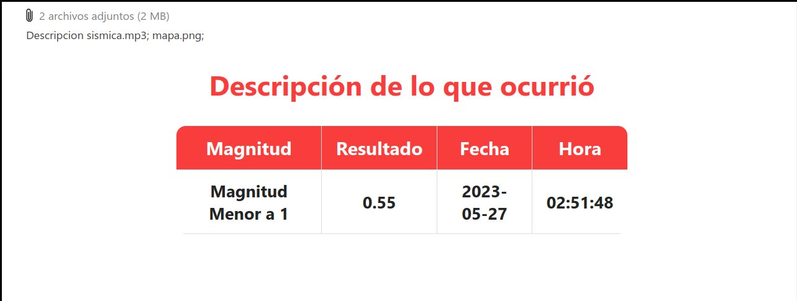
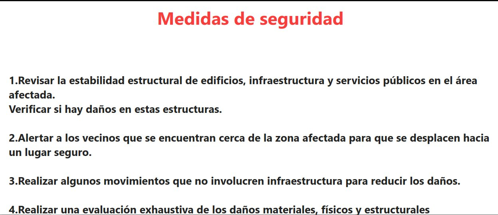
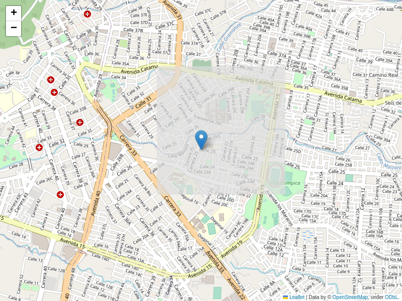

# Sistema-De-Alarma-Sismica
Este proyecto de alarma sísmica combina Arduino y Python para detectar y registrar eventos sísmicos, ofreciendo alertas visuales y sonoras. Además, permite el almacenamiento de datos en una base de datos y notifica al usuario mediante un correo electrónico personalizado proporcionado por el editor del código. Actualmente, el proyecto consume la API de OpenAI para brindar medidas de seguridad específicas según la magnitud detectada por el sensor, y esta información también se envía a través del correo electrónico.

Este proyecto puede ser considerado como un prototipo inicial. En su versión final, incluía la reproducción auditiva de la descripción del evento al momento de presenciar un evento sísmico, así como el envío de la ubicación actual en tiempo real donde ocurrie el evento sismico, junto con una imagen del mapa que mostraba la ubicación del evento sísmico. Lamentablemente, el código final se extravió con el tiempo. Sin embargo, el código proporcionado sigue siendo muy funcional y puede servir como una excelente base para futuras mejoras.

Componentes y Materiales del Proyecto:
- Placa Arduino UNO o compatible
- Sensor de aceleración ADXL345
- LEDs (indicadores de alarma)
- Zumbador (para alertas audibles)
- Resistencias de 220 ohmios (para limitar la corriente de los LEDs)
- Cables macho a macho (para conexiones entre componentes)
- Cables macho a hembra (para conexiones entre componentes)
- Servidor de base de datos MySQL o MariaDB
- Entorno de desarrollo Arduino (basado en el lenguaje de programación C/C++)
- Entorno Python
- Bibliotecas de Arduino: Adafruit_Sensor, Adafruit_ADXL345_U
- Bibliotecas Python: serial, mysql-connector, yagmail, openai
- Cuenta de correo electrónico para enviar alertas
- Clave de API de OpenAI

Instrucciones de Configuración:
1. Conectar el sensor ADXL345 al Arduino.
2. Conectar LEDs con resistencias de 220 ohmios y un zumbador al Arduino.
3. Configurar el servidor de base de datos y crear una tabla para almacenar datos sísmicos.
4. Configurar una cuenta de correo electrónico y obtener una contraseña de aplicación o token de acceso.
5. Establecer la clave de API de OpenAI en el código Python.

Instrucciones de Uso:
1. Cargar el código Arduino en la placa utilizando el entorno de desarrollo Arduino.
2. Ejecutar el script Python para recibir datos sísmicos y enviar alertas por correo electrónico.
3. El sistema enviará alertas cuando se detecte un sismo y proporcionará información sobre la magnitud.

Notas:
- Asegúrese de mantener seguras las credenciales y datos almacenados por el sistema.
- Realice pruebas y ajustes para garantizar el correcto funcionamiento de la alarma sísmica.

Resultado:
- Demostrando el funcionamiento actual del código de envío de correo electrónico:

  

  

- En su versión final, el proyecto también incluía la capacidad de mostrar la ubicación actual en tiempo real y una imagen que representaba la ubicación del evento sísmico. Sin embargo, lamentablemente, esta funcionalidad se perdió en el tiempo y queda como una idea para futuras mejoras.

  

- Originalmente, el proyecto incluía la posibilidad de agregar audio a los mensajes, pero lamentablemente, el código relacionado se ha extraviado. A pesar de ello, consideramos que la inclusión de audio podría enriquecer la experiencia del usuario y añadir un elemento adicional de interacción.

  <audio controls>
    <source src="Script_Python/aud/Descripcion sismica.mp3" type="audio/mpeg">
    Tu navegador no soporta la reproducción de audio.
  </audio>

